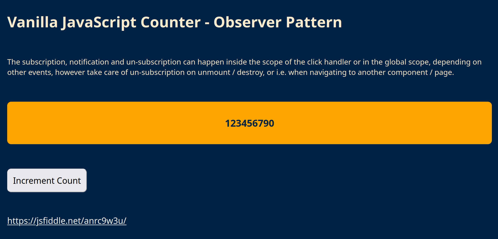

# Vanilla JavaScript Counter - Observer Pattern

## <a href="https://jsfiddle.net/anrc9w3u/">https://jsfiddle.net/anrc9w3u/</a>



```html
<!DOCTYPE html>
<html lang="en">
  <head>
    <meta charset="UTF-8" />
    <meta name="viewport" content="width=device-width, initial-scale=1.0" />
    <title>Vanilla JavaScript Counter - Observer Pattern</title>
    <style>
      html {
        background-color: #002244;
        color: blanchedalmond;
        font-family: system-ui, -apple-system, BlinkMacSystemFont, "Segoe UI", Roboto,
          Oxygen, Ubuntu, Cantarell, "Open Sans", "Helvetica Neue", sans-serif;
      }
      body {
        padding: 2rem;
        font-size: 1.4rem;
      }
      form,
      input,
      button,
      a {
        font-size: 1.6rem;
      }
      a {
        color: whitesmoke;
      }
      a:hover {
        color: green;
      }
      .prose {
        display: flex;
        flex-direction: column;
        gap: 1.4rem;
      }
      .text {
        font-size: 1.8rem;
        font-weight: bold;
        color: #002244;
        height: 8rem;
        display: flex;
        justify-content: center;
        align-items: center;
        background-color: orange;
        border-radius: 12px;
      }
      button {
        border-radius: 12px;
        padding: 1rem;
      }
    </style>
  </head>
  <body>
    <div class="prose">
      <h1>Vanilla JavaScript Counter - Observer Pattern</h1>
      <p>
        The subscription, notification and un-subscription can happen inside the
        scope of the click handler or in the global scope, depending on other
        events, however take care of un-subscription on unmount / destroy, or
        i.e. when navigating to another component / page.
      </p>
      <p class="text" id="count"></p>
      <p><button id="increment">Increment Count</button></p>
      <p>
        <a target="_blank" href="https://jsfiddle.net/anrc9w3u/"
          >https://jsfiddle.net/anrc9w3u/</a
        >
      </p>
    </div>
  </body>
  <script src="index.js"></script>
</html>
```

```js
function createCounter(initialCount) {
  let observers = [];
  let count = initialCount;

  function subscribe(func) {
    observers.push(func);
    return unsubscribe;
  }

  function get() {
    observers.forEach((observer) => observer(count));
    return count;
  }

  function set(newCount) {
    count = newCount;
    observers.forEach((observer) => observer(count));
    return count;
  }

  function unsubscribe(func) {
    observers = observers.filter((observer) => observer !== func);
  }

  return {
    subscribe,
    get,
    set,
    unsubscribe,
  };
}

let count = 0;
const counter = createCounter(count);

// The subscription, notification and un-subscription can happen inside the
// scope of the click handler or in the global scope, depending on other
// events, however take care of un-subscription on unmount / destroy, or
// i.e. when navigating to another component / page.

function logger(data) {
  console.log("current count : ", data);
}
counter.subscribe(logger);
// this logs the value a first time
counter.set(123456789);

// this logs the value a second time
counter.get();

const countElement = document.getElementById("count");
// this will update the DOM
// this logs the value a third time
countElement.innerHTML = counter.get();

// const increment = document.getElementById("increment");
increment.addEventListener("click", function (event) {
  // get current count - optional here since count is set external
  // the click event also logs the current value, the fourth time in sequence
  count = counter.get();

  // increment count
  count = count + 1;

  // set new count
  // this logs the new value
  countElement.innerHTML = counter.set(count);

  // as an alternative the subscription, notification and un-subscription
  // can happen inside the scope of the click handler
  /*
  counter.subscribe(logger);
  count = counter.get();
  count = count + 1;
  countElement.innerHTML = counter.set(count);
  counter.unsubscribe(logger);
  */
});
```
